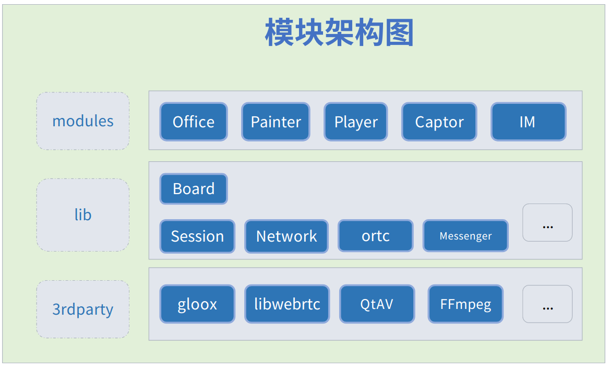
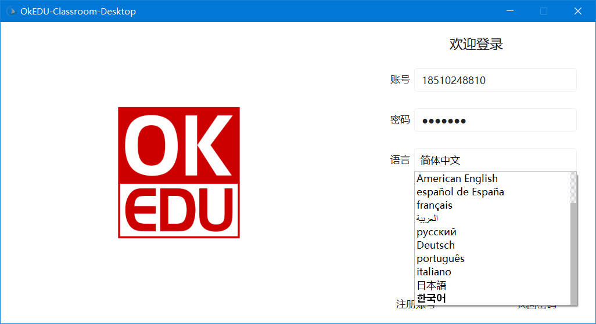
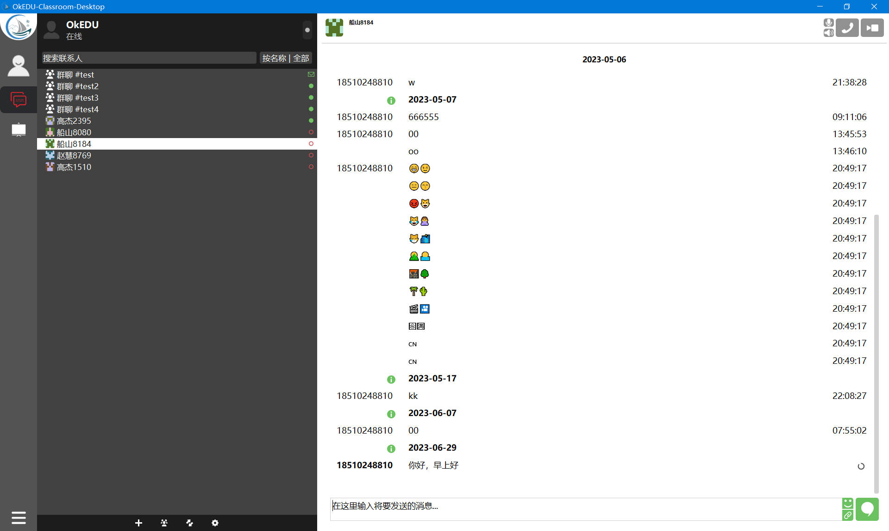
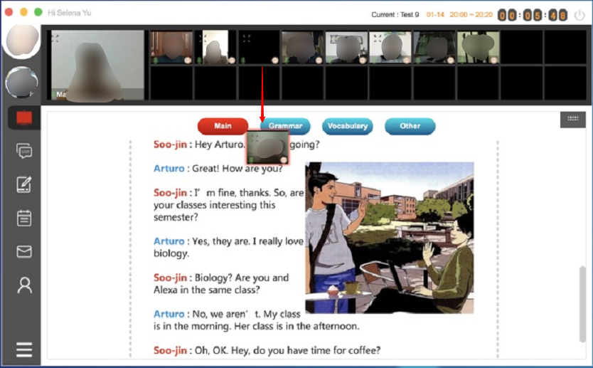
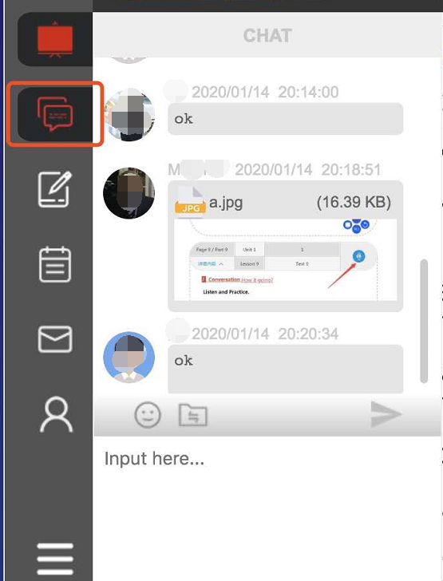

<h1 align="center">OkEDU-Desktop</h1>

  
  
  
  
  

# 🎁 项目介绍

**OkEDU 是基于“互联网+教育”理念， 解决在线上课问题而研发的互动教室。**
- 具备跨平台、拓展性等,
- 可独立部署私有化系统,
- 支持Windows、Linux、macOS平台,
- 终端有桌面版、Web版。

# 🧭 功能介绍
- 聊天模块
  - 具备单聊、群聊；
  - 支持文字、音视频、文件传输等基本功能；
  - 消息加密（计划中）。
  
- 教室模块 
  - 互动白板、课堂直播、交流互动、在线群聊等功能；

# 🏢 软件架构

# 🖼️ 界面展示

> 登录界面

> 消息主界面
> 

> 教室主界面
> 

> 教室白板界面

> 教室聊天界面

# ⛽ 第三方库

- CMake ([New BSD License](https://github.com/Kitware/CMake/blob/master/Copyright.txt))
- WebRTC ([New BSD License](https://github.com/desktop-app/tg_owt/blob/master/LICENSE))
- OpenSSL 3.0.x ([OpenSSL License](https://www.openssl.org/source/license.html))
- qTox([GPL v3](https://github.com/qTox/qTox/LICENSE))
- gloox ([GPL v3](https://gitee.com/chuanshantech/ok-edu-gloox))
- OpenAL Soft ([LGPL](https://github.com/kcat/openal-soft/blob/master/COPYING))
- FFmpeg ([LGPL](https://www.ffmpeg.org/legal.html))
- Qt 5.15 ([LGPL](http://doc.qt.io/qt-5/lgpl.html))
- QtAV ([Copyright © Wang Bin wbsecg1@gmail.com](https://github.com/wang-bin/QtAV))
- zlib ([zlib License](http://www.zlib.net/zlib_license.html))
- Sqlite3 ([Public Domain](https://sqlite.org/copyright.html))
- Sodium([ISC license.](https://github.com/jedisct1/libsodium))
- libexif([GPL v2](https://github.com/libexif/libexif/blob/master/COPYING))
- libqrencode([GPL v2+](https://github.com/fukuchi/libqrencode))

# 🖥️ 支持平台
> 🐧 Linux
- Ubuntu  已支持 文档：[Build On Ubuntu](./docs/BUILD-linux.md "Linux 构建")
- Fedora  计划中

> 🪟 Windows
- Windows10+ 已支持 文档：[Build On Windows](./docs/building/BUILD-win.md "Windows 构建")。

> 🍎 macOS
- 计划中   文档：[Build On macOS](./docs/building/BUILD-macos.md "MacOS 构建")。

# 🧰 编译环境

- ✅ 支持 **GCC On Linux**
- ✅ 支持 **Clang On Linux**
- ✅ 支持 **MSVC On Windows**
- ✅ 支持 **Clang On Windows**
- 📌 支持 **MinGW On Windows** 计划中
- 📌 支持 **Clang On macOS** 计划中

# ⚙️ 构建开发
- C++版本：C++20 
- Qt版本：Qt5.15.x

✔️ 支持**静态Qt编译** (Linux、Windows)。
✔️ 支持**动态Qt编译**（Linux、Windows）；

> 构建本项目需要分如下几步：
1. 准备工具链环境：[Linux](./docs/building/ToolChain-linux.md) | [Windows](./docs/building/ToolChain-win.md) | [macOS](./docs/building/ToolChain-macos.md) 计划中
2. 准备Qt环境：[Linux](./docs/building/Qt-linux.md) | [Windows](./docs/building/Qt-win.md) | [macOS](./docs/building/BUILD-macos.md) 计划中
3. 准备包依赖：[Linux](./docs/building/ThirdPart-linux.md)  | [Windows](./docs/building/ThirdPart-win.md) | [macOS](./docs/building/ThirdPart-macos.md) 计划中
4. 准备IDE开发： [VS Code](./docs/building/IDE-vscode.md) | [VS Studio](./docs/building/IDE-vsstudio.md) | [QtCreator](./docs/building/IDE-qtcreator.md) | [Clion](./docs/building/IDE-clion.md)
5. 动静态Qt配置: `CMakeLists.txt` 修改`set(LINK_STATIC_QT TRUE)`

# ⚒️ 开发规范

- Git  [Git规范](./docs/spec/git.md)
- Format [代码格式化](./docs/spec/format.md)
- 开发者规约（进行中）

# 🗓️ 版本规则
- 社区版本： 
  - 规则：{项目代号}-v{第1位}.{第2位}.{第3位}[-RC位]
  - 比如：如：OkEDU-v1.0.0、OkEDU-v1.0.0-rc；
  - 用户：面向公众、入门级用户、衍生专业版；
  - 维护者：社区；
- 专业版本：
  - 规则：{项目代号}-{yyMM}.{SP}-{PVD}-LTS
  - 比如：OkEDU-2410.5-HNCS-TLS；
  - 用户：面向客户、大型企业；
  - 维护者：社区+合作伙伴；
  
- 规则说明： 
  - 第1位：标识重大架构级变更（架构调整、接口改变、不兼容等变化）； 
  - 第2位：标识重要功能添加等（兼容主版本）； 
  - 第3位：标识bug修复、小范围优化等； 
  - RC位：表示候选版本，发布前的自测试阶段标识;
  - yyMM: 基于社区当前发布的版本年月；
  - SP：Service Pack 服务包序列，修复系统中的漏洞和问题、稳定性和优化等。
  - PVD：Provider 供应商，即合作伙伴代号；

# 🙏 感谢支持
- 感谢配合测试的同学，有赵慧、戴斌、沈雪琪等
- [感谢 JetBrains 对本项目的支持（Drive by JetBrains）](https://jb.gg/OpenSourceSupport) 

# ❤️ 捐赠方式

> 您的捐款是OkEDU开源项目持续前进的动力，希望该项目可以让任何人从中受益。
> 捐赠列表 https://kdocs.cn/l/cr7rVyXnbxuK

 

> 欢迎大家 Clone 本项目，捐赠收入将用于对贡献者的奖励。

# ⏰ 任务规划
- 2023年 
  1. 完成项目基本功能 
  2. 开启社区基本建设
  3. 开启社区项目内测
- 2024年
  1. 完成对各系统平台的支持
  2. 登录到各平台面向消费者
  3. 开启商业定制之路

> 【金山文档】 OkEDU任务列表 https://kdocs.cn/l/csib86aYwx0P

# 🏭 社区建设

> 为了OkEDU项目能长期有序有质量发展，诚邀有梦想情怀人士加入，一起建设社区，
> 目前规划需要如下方面人才：

- 开发、问题反馈、 Bug修复
- 文档、翻译、设计、品控
- 支持、推广、投资、项目管理

> 社区模式：敬请期待。。。
- 欢迎加入 [OkStar 社区](http://okstar.org)

# 🧑‍🤝‍🧑 贡献者
> 欢迎加入参与社区建设
- Joy1024
- 赵慧
- 漫步（化名）
- [更多](https://gitee.com/chuanshantech/ok-edu-classroom-desktop/contributors?ref=master)

# 💰 赞助商

[//]: # (- 湖南船山信息科技有限公司)
- Joy1024（个人）

# 📦 欢迎体验
- 下载地址：https://www.chuanshaninfo.com/download/OkEDU/
- 测试帐号：ok_1001到ok_1005，密码:okedu
- 更多请加微信：chuanshantech

# ☎️ 联系我们

> 技术交流群，添加微信：**okstar-org**（备注：**OkStar** 姓名）

> 微信公众号，关注账号：**OkEDU**

# ©️ 版权信息

> 本软件已经申请软件著作权和商标。

- ™️ 商标：**OkEDU** ® 

> 本项目采用双重授权，请按合规正确使用本项目！

1.遵循软件分发协议
  - 国际：**[GPL-2.0](https://opensource.org/license/gpl-2-0/)**
  - 中国：**[木兰公共许可证, 第2版](https://opensource.org/license/mulanpsl-2-0/)**

2.付费得到商业授权（试行）
  - [OKEDU软件合作伙伴合同-个人版](https://www.kdocs.cn/l/cgdtyImooeol)
  - OKEDU软件合作伙伴合同-团队版(计划中)
  - OKEDU软件合作伙伴合同-企业版(计划中)